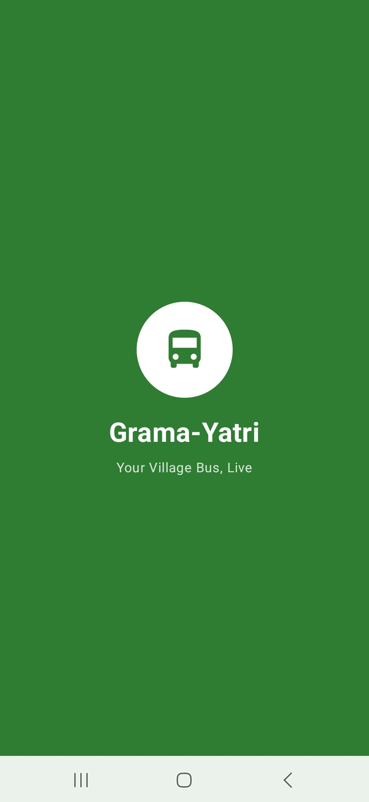
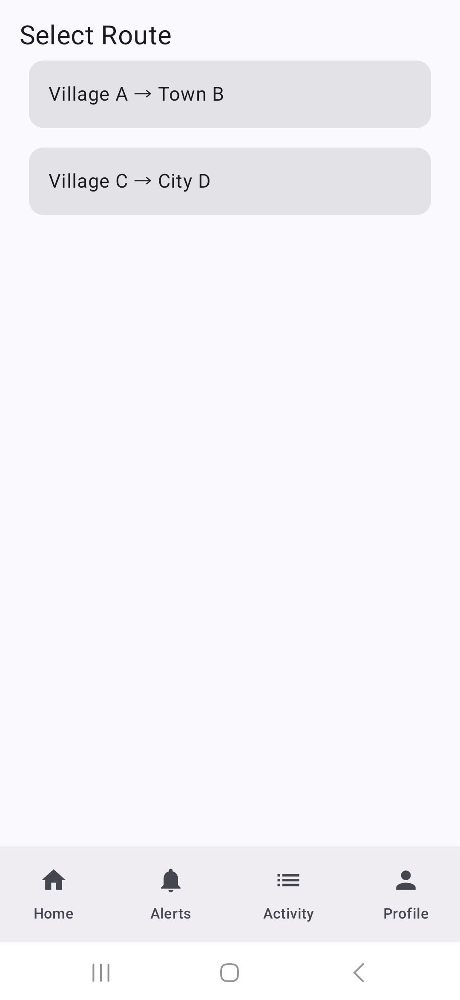
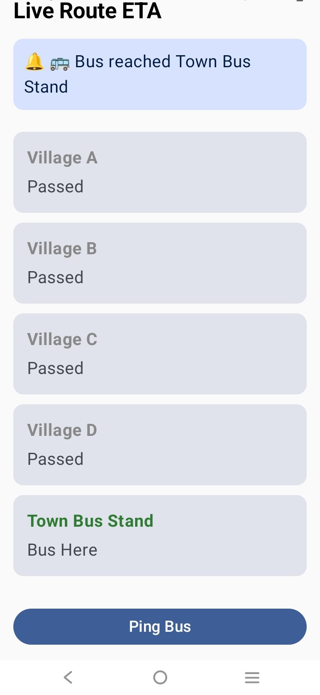
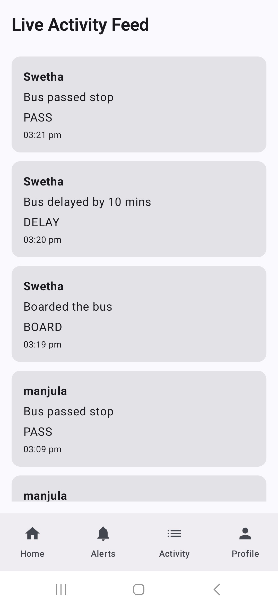
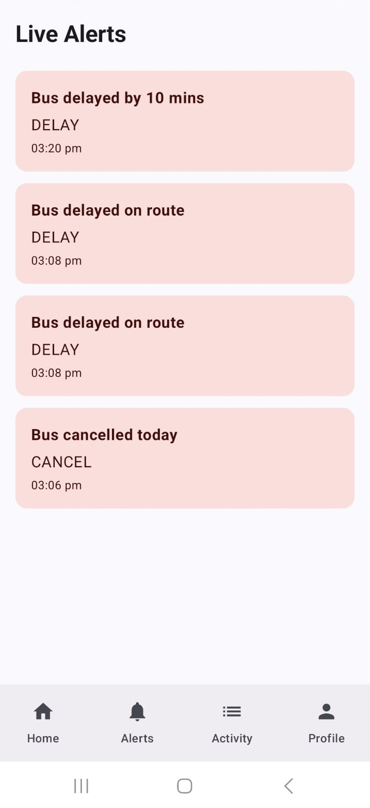

<h1 align="center">🚍 Grama Yatri</h1>

### Smart Rural Mobility Assistance Application
Grama Yatri is an Android-based rural mobility application designed to improve transportation accessibility for people living in villages and semi-urban areas.
The application helps users access transport-related information, route details, and essential travel services through a simple and user-friendly interface.

### Problem Statement
Many rural commuters face difficulties such as:
1. Lack of reliable transport information
2. Difficulty accessing route details
3. Limited digital transportation support
4. Poor communication regarding travel updates
Grama Yatri aims to bridge this gap by providing a digital platform that enhances transportation accessibility and convenience.

### Features
1. Responsive and modern UI
2. Route and transport information display
3. Firebase Realtime Database integration
4. Smooth screen navigation
5. User-friendly mobile experience
6. Scalable application architecture

### Tech Stack Used
1. Kotlin -	Android Application Development
2. Android Studio - Development Environment
3. Firebase Realtime Database	- Data Storage
4. Jetpack Components - UI & Navigation
5. Git & GitHub - Version Control

### Application Workflow
1.	User opens the application
2.	User signs in 
3.	Application fetches transport-related data
4.	User navigates through available features
5.	Data is updated and managed using Firebase

### Screenshots
### Splash Screen

### Login Screen

### Home Screen

### Ping Bus 

### Activity Screen

### Alerts Screen

### Setup
1. Clone repository
2. Open in Android Studio
3. Add Firebase configuration
4. Run the project

### Conclusion
Grama Yatri is a step toward improving rural transportation accessibility through technology. The application demonstrates practical implementation of 
Android development, Firebase integration, and modern mobile application design principles.

